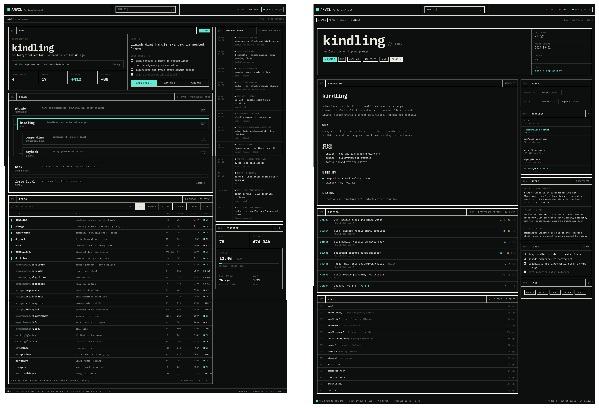

# pixlforge

My own git-forge frontend. Talks to the [Forgejo](https://forgejo.org/) API to
help me highlight the projects I work on. I might expand it into a full-fledged
CV page at a later point. Currently read-only, authenticating against forgejo
under consideration.

Built with [Nuxt](https://nuxt.com/), [Vue 3](https://vuejs.org/),
[D3.js](https://d3js.org/), and [TypeScript](https://www.typescriptlang.org/).

Based on this design mockup created by claude design


Uses `@hey-api/openapi-ts` to auto-generate the forgejo API client

## Tech Stack

| Layer      | Technology                                |
| ---------- | ----------------------------------------- |
| Framework  | Nuxt 4 (Nitro)                            |
| UI         | Vue 3 (Composition API)                   |
| API Client | @hey-api/openapi-ts                       |
| Validation | Zod                                       |
| Caching    | @nuxthub/core (fs-lite)                   |
| Testing    | Jest                                      |

## Setup

```bash
npm install
```

Create a `.env` file in the project root:

```
NUXT_FORGEJO_RENDER_MARKDOWN_TOKEN=<your-forgejo-token>
```

This token is used server-side to render repository READMEs through the Forgejo markdown API.

Create the token by going to: `Settings` -> `Applications` -> `Generate new Token`

Min. Permissions: `Public Only`, `misc`: `Read and Write`

## Development

```bash
npm run dev
# or to attach a debugger:
npm run debug
```

The dev server starts at `http://localhost:3000`.

## Testing

```bash
npm test
```

## Production

```bash
npm run build
npm run preview
```
